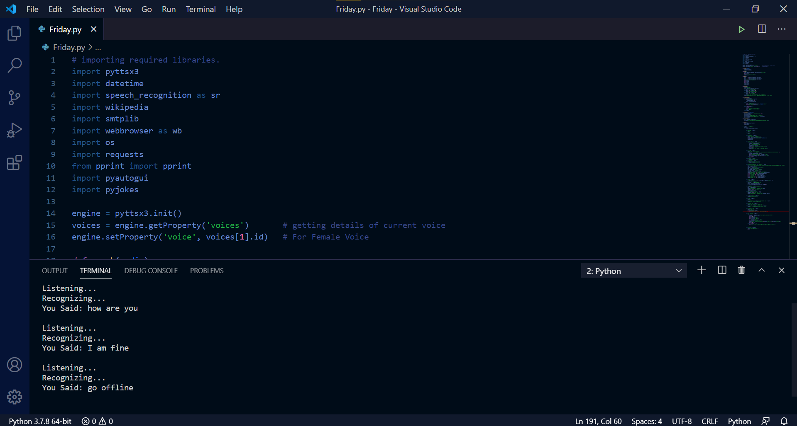

# FRIDAY AI Assistant &emsp;           
 

- __Artificial Intelligence Assistant__ using Python Programming Language and Libraries.
- Can automate your task.
 

      

 

## Prerequsites:

- Python 3.X and for 3.6+ Version, Must Check [https://www.lfd.uci.edu/~gohlke/pythonlibs](https://www.lfd.uci.edu/~gohlke/pythonlibs/#pyaudio.)

- pyttsx3
- pyaudio
- speech recongnition
- wikipedia
- webbrowser
- pyautogui
- pyjokes
- requests

## License
Licensed under the [MIT License](https://github.com/amandp13/Friday-AI-Assistant/blob/master/LICENSE)
